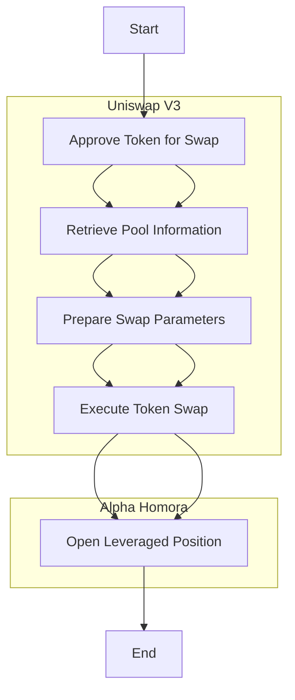

---

# Overview of the Script

The script is designed to interact with several DeFi protocols to perform a sequence of decentralized finance (DeFi) operations, including token swapping and opening leveraged positions. The key protocols and operations involved are:

### 1. **Uniswap V3 (for Token Swapping)**
   - **Token Swap**: The script allows the user to swap tokens on Uniswap V3 by interacting with the factory and pool contracts. It approves the token for swapping, retrieves pool information, prepares swap parameters, and executes the swap.

### 2. **Alpha Homora (for Leveraged Positions)**
   - **Leveraged Position**: After swapping tokens on Uniswap V3, the script interacts with Alpha Homora to open a leveraged position. It calculates the required borrow amount based on the leverage multiplier provided by the user and executes the leveraged position.

## Workflow Description

### 1. **Token Approval**
   - The script first approves the spending of USDC (or another token) on the Uniswap V3 swap router. This step is necessary for the subsequent swap operation.

### 2. **Retrieve Pool Information**
   - The script retrieves the necessary information about the liquidity pool on Uniswap V3 that involves the two tokens (e.g., USDC and LINK). This includes details like the pool address, tokens involved, and swap fee.

### 3. **Prepare Swap Parameters**
   - Based on the pool information, the script prepares the necessary parameters for executing the token swap. This includes the input and output tokens, swap fee, amount to swap, and other necessary details.

### 4. **Execute Token Swap**
   - The script executes the token swap on Uniswap V3, converting USDC to LINK (or any other specified token). The transaction is sent to the network, and a receipt is generated to confirm the swap.

### 5. **Open Leveraged Position on Alpha Homora**
   - After the swap, the script interacts with the Alpha Homora contract to open a leveraged position. The user can specify a leverage multiplier, and the script borrows the required amount to execute the leveraged trade, allowing the user to maximize their exposure.

## Diagram Illustration



This diagram shows the sequence of steps in the script, highlighting the interactions with Uniswap V3 and Alpha Homora protocols. The process starts with token approval, continues through the swap on Uniswap, and ends with the opening of a leveraged position on Alpha Homora.

---

## Code Explanation

This script is a comprehensive example of interacting with multiple DeFi protocols using the Ethereum blockchain. Below is a detailed explanation of each part of the code:

### 1. **Importing Required Libraries and ABIs**
   ```javascript
   import { ethers } from "ethers";
   import FACTORY_ABI from "./abis/factory.json" assert { type: "json" };
   import SWAP_ROUTER_ABI from "./abis/swaprouter.json" assert { type: "json" };
   import POOL_ABI from "./abis/pool.json" assert { type: "json" };
   import TOKEN_IN_ABI from "./abis/token.json" assert { type: "json" };
   import ALPHA_HOMORA_ABI from "./abis/alphaHomora.json" assert { type: "json" };

   import dotenv from "dotenv";
   dotenv.config();
   ```

   - **ethers**: A popular Ethereum library for interacting with the blockchain.
   - **FACTORY_ABI, SWAP_ROUTER_ABI, POOL_ABI, TOKEN_IN_ABI, ALPHA_HOMORA_ABI**: These are the ABI (Application Binary Interface) files required to interact with the smart contracts.
   - **dotenv**: Loads environment variables from a `.env` file, typically used to store sensitive information like private keys and RPC URLs.

### 2. **Setting Up Contract Addresses and Provider**
   ```javascript
   const POOL_FACTORY_CONTRACT_ADDRESS = "0x0227628f3F023bb0B980b67D528571c95c6DaC1c";
   const SWAP_ROUTER_CONTRACT_ADDRESS = "0x3bFA4769FB09eefC5a80d6E87c3B9C650f7Ae48E";
   const ALPHA_HOMORA_CONTRACT_ADDRESS = "0xYourAlphaHomoraAddress"; // Replace with actual address

   const provider = new ethers.JsonRpcProvider(process.env.RPC_URL);
   const factoryContract = new ethers.Contract(
     POOL_FACTORY_CONTRACT_ADDRESS,
     FACTORY_ABI,
     provider
   );
   const signer = new ethers.Wallet(process.env.PRIVATE_KEY, provider);
   ```

   - **Contract Addresses**: These are the addresses of the smart contracts on the blockchain.
   - **provider**: Connects to the Ethereum network using the RPC URL provided in the environment file.
   - **factoryContract**: Creates an instance of the Factory contract to interact with the Uniswap pool.
   - **signer**: Represents the user's wallet, used to sign transactions.

### 3. **Token Configuration**
   ```javascript
   const USDC = {
     chainId: 11155111,
     address: "0x1c7D4B196Cb0C7B01d743Fbc6116a902379C7238",
     decimals: 6,
     symbol: "USDC",
     name: "USD//C",
     isToken: true,
     isNative: true,
     wrapped: false,
   };

   const LINK = {
     chainId: 11155111,
     address: "0x779877A7B0D9E8603169DdbD7836e478b4624789",
     decimals: 18,
     symbol: "LINK",
     name: "Chainlink",
     isToken: true,
     isNative: true,
     wrapped: false,
   };
   ```

   - **USDC and LINK Objects**: Define the tokens that will be used in the swap, including their addresses, decimals, and other relevant metadata.

### 4. **Token Approval Function**
   ```javascript
   async function approveToken(tokenAddress, tokenABI, amount, wallet) {
     try {
       const tokenContract = new ethers.Contract(tokenAddress, tokenABI, wallet);
       const approveAmount = ethers.parseUnits(amount.toString(), USDC.decimals);
       const approveTransaction = await tokenContract.approve.populateTransaction(
         SWAP_ROUTER_CONTRACT_ADDRESS,
         approveAmount
       );
       const transactionResponse = await wallet.sendTransaction(approveTransaction);
       console.log(`Transaction Sent: ${transactionResponse.hash}`);
       const receipt = await transactionResponse.wait();
       console.log(`Approval Transaction Confirmed! https://sepolia.etherscan.io/tx/${receipt.hash}`);
     } catch (error) {
       console.error("An error occurred during token approval:", error);
       throw new Error("Token approval failed");
     }
   }
   ```

   - **approveToken**: This function allows the user to approve the spending of a specific token by the Uniswap V3 Swap Router contract. It ensures that the contract has permission to spend the specified amount of the user's tokens.

### 5. **Get Pool Information Function**
   ```javascript
   async function getPoolInfo(factoryContract, tokenIn, tokenOut) {
     const poolAddress = await factoryContract.getPool(
       tokenIn.address,
       tokenOut.address,
       3000
     );
     if (!poolAddress) {
       throw new Error("Failed to get pool address");
     }
     const poolContract = new ethers.Contract(poolAddress, POOL_ABI, provider);
     const [token0, token1, fee] = await Promise.all([
       poolContract.token0(),
       poolContract.token1(),
       poolContract.fee(),
     ]);
     return { poolContract, token0, token1, fee };
   }
   ```

   - **getPoolInfo**: Retrieves information about the Uniswap pool for the specified token pair (e.g., USDC and LINK). It uses the factory contract to get the pool address and then fetches details like the tokens involved and the fee structure.

### 6. **Prepare Swap Parameters Function**
   ```javascript
   async function prepareSwapParams(poolContract, signer, amountIn) {
     return {
       tokenIn: USDC.address,
       tokenOut: LINK.address,
       fee: await poolContract.fee(),
       recipient: signer.address,
       amountIn: amountIn,
       amountOutMinimum: 0,
       sqrtPriceLimitX96: 0,
     };
   }
   ```

   - **prepareSwapParams**: Prepares the parameters needed to execute a token swap on Uniswap V3. It sets the input token, output token, fee, recipient, and the amount to swap. It also includes options like `amountOutMinimum` to protect against slippage.

### 7. **Execute Swap Function**
   ```javascript
   async function executeSwap(swapRouter, params, signer) {
     const transaction = await swapRouter.exactInputSingle.populateTransaction(params);
     const receipt = await signer.sendTransaction(transaction);
     console.log(`Receipt: https://sepolia.etherscan.io/tx/${receipt.hash}`);
   }
   ```

   - **executeSwap**: Executes the token swap on Uniswap V3 using the prepared parameters. The transaction is signed and sent by the signer, and the receipt is logged to confirm the swap.

### 8. **Alpha Homora Leverage Function**
   ```javascript
   async function openLeveragedPosition(
     alphaHomoraContract,
     swapAmount,
     tokenIn,
     tokenOut,
     leverageMultiplier,
     signer
   ) {
     try {
       const amountIn = ethers.parseUnits(swapAmount.toString(), tokenIn.decimals);

       const leverageParams = {
         token: tokenOut.address,
         amount: amountIn,
         borrow: amountIn.mul(leverageMultiplier - 1),
         minReceive: 0,
         leverage: leverageMultiplier,
       };

       const tx = await alphaHomoraContract.leverage(leverageParams);
       console.log(`Transaction Sent: ${tx.hash}`);
       const receipt = await tx.wait();
       console.log(`Leveraged Position Opened! https://sepolia.etherscan.io/tx/${receipt.hash}`);
     } catch (error) {
       console.error("An error occurred while opening a leveraged position:", error);
       throw new Error("Leverage position failed");
     }
   }
   ```

   - **openLeveragedPosition**: Interacts with the Alpha Homora protocol to open a leveraged position. It calculates the amount to borrow based on the leverage multiplier and executes the leverage trade. This function is critical for users looking to amplify their positions using leverage.

### 9. **Main Function**
   ```javascript
   async function main(swapAmount, leverageMultiplier) {
     const inputAmount = swapAmount;
     const amountIn = ethers.parseUnits(inputAmount.toString(), USDC.decimals);

     try {
       // Approve USDC for swap
       await approveToken(USDC.address, TOKEN_IN_ABI, inputAmount, signer);

       // Get Pool Info
       const { poolContract } = await getPoolInfo(factoryContract, USDC, LINK);

       // Prepare Swap Params and Execute Swap
       const params = await prepareSwapParams(poolContract, signer, amountIn);
       const swapRouter = new ethers.Contract(
         SWAP_ROUTER_CONTRACT_ADDRESS,
         SWAP_ROUTER_ABI,
         signer
       );
       await executeSwap(swapRouter, params, signer);

       // Alpha Homora - Open leveraged position
       const alphaHomoraContract = new ethers.Contract(
         ALPHA_HOMORA_CONTRACT_ADDRESS,
         ALPHA_HOMORA_ABI,
         signer
       );
       await openLeveragedPosition(
         alphaHomoraContract,
         swapAmount,
         USDC,
         LINK,
         leverageMultiplier,
         signer
       );
     } catch (error) {
       console.error("An error occurred:", error.message);
     }
   }

   // Enter Swap Amount and Leverage Multiplier
   main(1, 

2); // Example: Swap 1 USDC with 2x leverage
   ```

   - **main**: Orchestrates the entire process by calling the other functions in sequence. It approves the USDC token for swapping, retrieves pool information, prepares the swap parameters, executes the swap, and finally opens a leveraged position on Alpha Homora.
   - **Parameters**: The `swapAmount` and `leverageMultiplier` are the key inputs, specifying how much USDC to swap and the level of leverage to apply.

### Summary

This script effectively combines several advanced DeFi operations, including token swapping on Uniswap V3 and leveraging positions on Alpha Homora. Each function in the script handles a specific part of the workflow, from approving tokens to executing complex financial operations on the blockchain. The script is modular and can be adapted to work with different tokens, swap amounts, and leverage levels, making it a powerful tool for DeFi enthusiasts and developers.

---